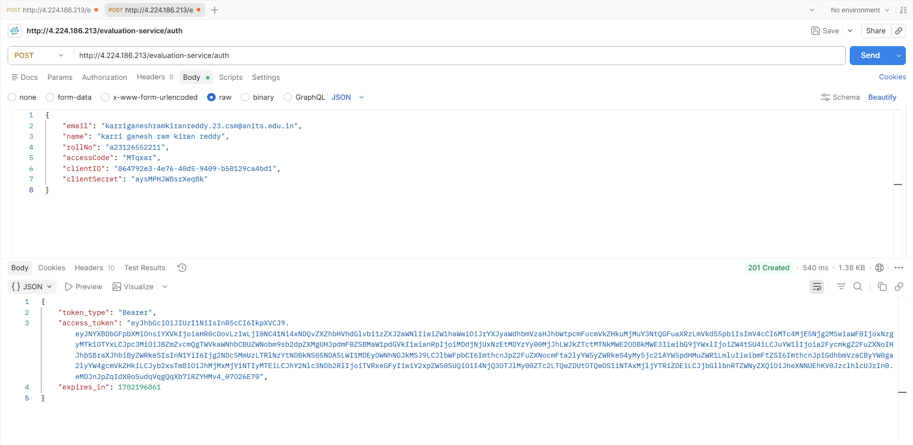
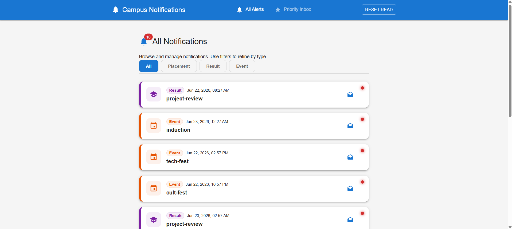

# Campus Notification System

This project is a full-stack campus notification system.

## Setup and Running

1. Install dependencies in the root, frontend, and backend folders.
2. Set up the .env file in the root with the credentials.
3. Start the backend: npm run dev in the backend directory.
4. Start the frontend: npm run dev in the frontend directory.

## Project Structure

- logging/ : Contains the custom logger middleware.
- notification-app-be/ : Contains the Express.js proxy backend server.
- notification-app-fe/ : Contains the React/MUI frontend application.
- priority-inbox/ : Contains the standalone priority inbox ranking script.

## Screenshots

### Authentication

### Notifications Lists and Filtering

### Logger Middleware

### Standalone Priority Inbox Execution

.png)
