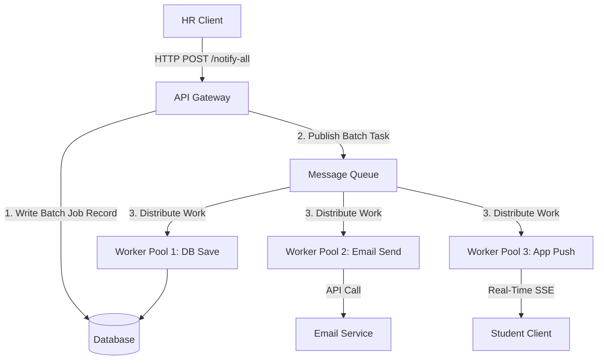

# Notification System Design

---

## Stage 1: API Design & Real-Time Architecture

To display notifications to logged-in users, the platform should support retrieving, filtering, and marking notifications as read/unread. Below is the REST API design for the notification system.

### Core Actions
1. **Retrieve Notifications**: Paginated list of notifications with type filtering.
2. **Mark Notification as Read**: Toggle read status of a notification.
3. **Mark All as Read**: Bulk update to clear unread counts.
4. **Push Real-Time Notification**: Server-to-client push for active sessions.

### API Endpoints

#### 1. Fetch Notifications
* **Endpoint**: `GET /api/v1/notifications`
* **Headers**:
  * `Authorization: Bearer <JWT_TOKEN>`
  * `Accept: application/json`
* **Query Parameters**:
  * `page` (integer, default: 1): Current page.
  * `limit` (integer, default: 10): Items per page.
  * `type` (string, optional): Filter by `Placement`, `Result`, or `Event`.
  * `unread_only` (boolean, default: false): Fetch only unread notifications.
* **Response Payload (Status: 200 OK)**:
  ```json
  {
    "notifications": [
      {
        "id": "d146095a-0d86-4a34-9e69-3900a14576bc",
        "type": "Result",
        "message": "Mid-semester exam results published.",
        "isRead": false,
        "createdAt": "2026-06-23T11:15:30Z"
      }
    ],
    "pagination": {
      "currentPage": 1,
      "totalPages": 5,
      "pageSize": 10,
      "totalItems": 48
    }
  }
  ```

#### 2. Mark Notification as Read
* **Endpoint**: `PATCH /api/v1/notifications/:id/read`
* **Headers**:
  * `Authorization: Bearer <JWT_TOKEN>`
  * `Content-Type: application/json`
* **Request Body**:
  ```json
  {
    "isRead": true
  }
  ```
* **Response Payload (Status: 200 OK)**:
  ```json
  {
    "id": "d146095a-0d86-4a34-9e69-3900a14576bc",
    "isRead": true,
    "updatedAt": "2026-06-23T11:18:00Z"
  }
  ```

### Real-Time Notification Mechanism
To deliver notifications instantly, we will use **Server-Sent Events (SSE)**.
* **Why SSE?** Notifications are unidirectional (server-to-client). SSE is lightweight, operates over standard HTTP/1.1 or HTTP/2, auto-reconnects, and is simpler to scale than WebSockets since it doesn't require a custom bi-directional protocol wrapper.
* **Flow**:
  1. Client establishes connection at `GET /api/v1/notifications/stream`.
  2. Server holds the HTTP request open with headers:
     * `Content-Type: text/event-stream`
     * `Cache-Control: no-cache`
     * `Connection: keep-alive`
  3. When an event occurs (e.g. Placement), the server publishes to a Redis Pub/Sub channel keyed by student ID. The active SSE handler receives the event and writes it to the HTTP stream.

---

## Stage 2: Database Schema & Scaling

### Database Recommendation: Relational (PostgreSQL)
We suggest **PostgreSQL** for persistent storage:
* **Strong Consistency**: Avoids race conditions between marking notifications as read and reading notification lists.
* **Complex Querying**: Allows indexing composite fields (`student_id`, `is_read`, `created_at`) to optimize sorting by recency.
* **ACID Transactions**: Guarantees database state integrity during bulk updates.

### DB Schema

```sql
CREATE TYPE notification_category AS ENUM ('Placement', 'Result', 'Event');

CREATE TABLE students (
    id SERIAL PRIMARY KEY,
    roll_no VARCHAR(50) UNIQUE NOT NULL,
    name VARCHAR(100) NOT NULL,
    email VARCHAR(150) UNIQUE NOT NULL,
    created_at TIMESTAMP WITH TIME ZONE DEFAULT CURRENT_TIMESTAMP
);

CREATE TABLE notifications (
    id UUID PRIMARY KEY DEFAULT gen_random_uuid(),
    student_id INTEGER NOT NULL REFERENCES students(id) ON DELETE CASCADE,
    type notification_category NOT NULL,
    message TEXT NOT NULL,
    is_read BOOLEAN DEFAULT FALSE NOT NULL,
    created_at TIMESTAMP WITH TIME ZONE DEFAULT CURRENT_TIMESTAMP NOT NULL
);

-- Optimization Indexes
CREATE INDEX idx_notifications_lookup 
ON notifications (student_id, is_read, created_at DESC);
```

### High-Volume Problems & Solutions
As volume grows to millions of rows, database scaling issues emerge:
1. **Slow Sequential Scans**: Reading unread notifications requires scanning pages.
   * *Solution*: Implement the composite index `(student_id, is_read, created_at)` so lookup is $O(\log N)$.
2. **Write Saturation**: During placement season, bulk notifications lock tables.
   * *Solution*: Implement **Horizontal Table Partitioning** by hash of `student_id` or range of `created_at`. Archive read notifications older than 30 days to a historical table (hot/cold data tiering).
3. **Connection Pool Exhaustion**: High concurrent connections from student browsers.
   * *Solution*: Deploy **PgBouncer** for connection pooling, and read replicas to offload read queries.

### Basic SQL Queries
* **Fetch Unread Notifications**:
  ```sql
  SELECT id, type, message, is_read, created_at 
  FROM notifications 
  WHERE student_id = 1042 AND is_read = FALSE 
  ORDER BY created_at DESC 
  LIMIT 10 OFFSET 0;
  ```
* **Mark single notification as read**:
  ```sql
  UPDATE notifications 
  SET is_read = TRUE 
  WHERE id = 'd146095a-0d86-4a34-9e69-3900a14576bc' AND student_id = 1042;
  ```

---

## Stage 3: Query Optimization

### Query Performance Analysis
The query is:
```sql
SELECT * FROM notifications WHERE studentID = 1042 AND isRead = false ORDER BY createdAt ASC;
```

1. **Is the query accurate?** Yes, it correctly filters unread notifications for a specific student and sorts them from oldest to newest.
2. **Why is it slow?** With 50,000 students and 5,000,000 notifications, if there is no index on `(studentID, isRead)`, the database engine must execute a **Seq Scan** (Full Table Scan), evaluating every single row in the database.
3. **What to change & computation cost**:
   * *Action*: Create a composite index:
     ```sql
     CREATE INDEX idx_student_unread_created ON notifications (studentID, isRead, createdAt ASC);
     ```
   * *Cost change*: Lookup changes from $O(N)$ (where $N = 5,000,000$) to $O(\log N)$ + $O(K)$ (where $K$ is the number of unread notifications for that student, which is usually $< 50$). Query latency drops from seconds to $< 1$ millisecond.

### "Index Every Column" Critique
Adding indexes to every column is **ineffective** and dangerous:
1. **Write Overhead**: Every `INSERT`, `UPDATE`, or `DELETE` forces the database to write index entries. Write speeds will degrade drastically.
2. **Disk and Buffer Space**: Indexes are stored in memory/disk. Indexes bloat database size, pushing index tables out of RAM (cache misses), slowing down overall database performance.
3. **Optimizer Confusion**: The query planner spends extra time evaluating which index to use, leading to sub-optimal execution plan selection.

### Last 7 Days Placement Query
Query to find all student IDs who received a placement notification in the last 7 days:
```sql
SELECT DISTINCT student_id 
FROM notifications 
WHERE type = 'Placement' 
  AND created_at >= NOW() - INTERVAL '7 days';
```
*(Optimization: An index on `(type, created_at)` will make this query instant).*

---

## Stage 4: High-Load Performance & Tradeoffs

To stop DB overload on page loads, we implement the following optimization strategies:

| Strategy | Performance Benefit | Tradeoffs / Drawbacks |
| :--- | :--- | :--- |
| **1. Caching (Redis)** | High-speed read of unread count and latest notifications ($<1\text{ms}$). | Cache invalidation overhead on write/read toggle; memory cost. |
| **2. HTTP Conditional Headers** | Uses `ETag` or `Last-Modified`. Client skips download if no new alerts. | Saves network bandwidth, but backend must still check DB state. |
| **3. Read Replicas** | Spreads read query load away from write database master. | Brief replication lag (students might see notification delayed by milliseconds). |
| **4. Event-Driven Push** | SSE pushes alerts only on creation. Reduces browser polling to zero. | Connection management state; resource cost on server to maintain 50k SSE sockets. |

---

## Stage 5: Reliability & Message Queue Redesign

### Critique of Proposed Implementation

```python
function notify_all(student_ids: array, message: string):
  for student_id in student_ids:
    save_to_db(student_id, message)
    send_email(student_id, message)
    push_to_app(student_id, message)
```

1. **Shortcoming 1: Blocker Loop (Latency)**: Sending an email synchronously takes ~100ms. Sending to 50,000 students takes $\approx 5,000$ seconds ($1.4$ hours). The request will timeout, blocking the HR UI.
2. **Shortcoming 2: Cascading Failure**: If `send_email` fails midway (e.g., at student 200), the loop halts. Remaining 49,800 students receive nothing, and we have no state tracking to resume.
3. **Shortcoming 3: Tight Coupling**: Database insert, email API, and SSE push are executed sequentially. If email is slow/failed, in-app push is blocked.

### Decoupling Architecture Redesign
We separate database inserts from notifications, using a **Message Queue** (e.g. BullMQ/RabbitMQ) with worker pools.



### Revised Pseudocode
```python
# API Endpoint called by HR UI
function handle_notify_all_request(message):
    job_id = create_notification_batch_job(message)
    # Fast dispatch: push job to queue and return status 202 instantly
    queue.push("process_batch", {job_id: job_id, message: message})
    return { status: 202, job_id: job_id }

# Worker 1: Producer to split into individual tasks
function process_batch_job(task):
    students = get_all_student_ids() # Fetches 50,000 IDs
    
    # Chunk messages for database ingestion (bulk insert is faster)
    db_chunks = chunk(students, 1000)
    for chunk in db_chunks:
        queue.push("bulk_save_db", {chunk: chunk, message: task.message})
        
    # Queue individual notifications for workers to handle failures independently
    for student_id in students:
        queue.push("send_email_task", {student_id: student_id, message: task.message}, retry=3, backoff="exponential")
        queue.push("push_app_task", {student_id: student_id, message: task.message}, retry=2)

# Worker 2: Bulk Database Ingestion
function handle_bulk_save_db(task):
    db.insert_many_notifications(task.chunk, task.message)

# Worker 3: Email Dispatcher
function handle_send_email_task(task):
    try:
        email_service.send(task.student_id, task.message)
    catch EmailError as e:
        # Queue automatically handles retries with exponential backoff
        throw e
```

---

## Stage 6: Priority Inbox Design & Algorithm

### Approach Explanation
The Priority Inbox displays the top `n` most important unread notifications. Priority is calculated using a combination of **weight** and **recency**:

$$\text{Priority Score} = (\text{Weight} \times 100,000) + (\text{Recency Factor})$$

* **Weights**:
  * `Placement` = 3
  * `Result` = 2
  * `Event` = 1
* **Recency Factor**: Difference in Unix timestamp compared to a base epoch time.
* By multiplying weight by a scale factor ($100,000$), we ensure categorization weight dominates the general sort, but notifications within the same category are strictly ordered by recency.

We maintain this list efficiently by sorting the dataset. For scaling with millions of records, we can maintain a client-side binary heap, or use Redis **Sorted Sets (ZSET)** with scores set to this calculated Priority Score, fetching the top `n` records in $O(\log M + K)$ time complexity.
